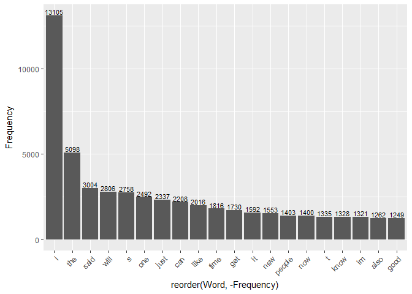

# Data Mining - Natural Language Processing
Jack Welch  
July 26, 2017  


```r
# Use cache inside R markdown file
knitr::opts_chunk$set(cache = TRUE)

# Load the required libraries
library(tm)
library(stringi)
library(NLP)
library(qdap)
library(RWeka)
library(ggplot2)
library(wordcloud)
```

## Course Dataset - from Johns Hopkins University

The dataset that is required to be used as traininig data for this capstone project is located at the following URL.  

* [https://d396qusza40orc.cloudfront.net/dsscapstone/dataset/Coursera-SwiftKey.zip](https://d396qusza40orc.cloudfront.net/dsscapstone/dataset/Coursera-SwiftKey.zip)

Since this is a rather large dataset, I have begun by doing a manual download and unzip of this data.  I obtained my dataset on the date of this report.  A copy of my data is located locally on my personal computer in the *data* sub-folder.  Due to file size limitations set by GitHub, I will not be uploading my original data files that I have downloaded from this URL.

## Getting and Cleaning the Data

### Load the Data Into R

Use the readlines() function to read the .txt files into memory inside R.


```r
# Load the Twitter data
twitter <- readLines(con <- file("./data/en_US.twitter.txt"), encoding = "UTF-8", skipNul = TRUE)
close(con)

# Load the Blog data
blogs <- readLines(con <- file("./data/en_US.blogs.txt"), encoding = "UTF-8", skipNul = TRUE)
close(con)

# Load the News data
news <- readLines(con <- file("./data/en_US.news.txt"), encoding = "UTF-8", skipNul = TRUE)
close(con)
```

### Simple Visualization for Human Inspection

The R head() function allows us to be able to visualize the first six rows of each of the vector variables: twitter, blogs, and news.


```r
# Head of Twitter file
head(twitter)
```

```
## [1] "How are you? Btw thanks for the RT. You gonna be in DC anytime soon? Love to see you. Been way, way too long."  
## [2] "When you meet someone special... you'll know. Your heart will beat more rapidly and you'll smile for no reason."
## [3] "they've decided its more fun if I don't."                                                                       
## [4] "So Tired D; Played Lazer Tag & Ran A LOT D; Ughh Going To Sleep Like In 5 Minutes ;)"                           
## [5] "Words from a complete stranger! Made my birthday even better :)"                                                
## [6] "First Cubs game ever! Wrigley field is gorgeous. This is perfect. Go Cubs Go!"
```

```r
# Head of Blogs file
head(blogs)
```

```
## [1] "In the years thereafter, most of the Oil fields and platforms were named after pagan <U+0093>gods<U+0094>."                                                                                                                                                                                                                                                                                                                                                                                                                                                                                                                                                                                                                        
## [2] "We love you Mr. Brown."                                                                                                                                                                                                                                                                                                                                                                                                                                                                                                                                                                                                                                                                                              
## [3] "Chad has been awesome with the kids and holding down the fort while I work later than usual! The kids have been busy together playing Skylander on the XBox together, after Kyan cashed in his $$$ from his piggy bank. He wanted that game so bad and used his gift card from his birthday he has been saving and the money to get it (he never taps into that thing either, that is how we know he wanted it so bad). We made him count all of his money to make sure that he had enough! It was very cute to watch his reaction when he realized he did! He also does a very good job of letting Lola feel like she is playing too, by letting her switch out the characters! She loves it almost as much as him."
## [4] "so anyways, i am going to share some home decor inspiration that i have been storing in my folder on the puter. i have all these amazing images stored away ready to come to life when we get our home."                                                                                                                                                                                                                                                                                                                                                                                                                                                                                                             
## [5] "With graduation season right around the corner, Nancy has whipped up a fun set to help you out with not only your graduation cards and gifts, but any occasion that brings on a change in one's life. I stamped the images in Memento Tuxedo Black and cut them out with circle Nestabilities. I embossed the kraft and red cardstock with TE's new Stars Impressions Plate, which is double sided and gives you 2 fantastic patterns. You can see how to use the Impressions Plates in this tutorial Taylor created. Just one pass through your die cut machine using the Embossing Pad Kit is all you need to do - super easy!"                                                                                    
## [6] "If you have an alternative argument, let's hear it! :)"
```

```r
# Head of News file
head(news)
```

```
## [1] "He wasn't home alone, apparently."                                                                                                                                                                                                                                                                                                                                                                                                                                                                                 
## [2] "The St. Louis plant had to close. It would die of old age. Workers had been making cars there since the onset of mass automotive production in the 1920s."                                                                                                                                                                                                                                                                                                                                                         
## [3] "WSU's plans quickly became a hot topic on local online sites. Though most people applauded plans for the new biomedical center, many deplored the potential loss of the building."                                                                                                                                                                                                                                                                                                                                 
## [4] "The Alaimo Group of Mount Holly was up for a contract last fall to evaluate and suggest improvements to Trenton Water Works. But campaign finance records released this week show the two employees donated a total of $4,500 to the political action committee (PAC) Partners for Progress in early June. Partners for Progress reported it gave more than $10,000 in both direct and in-kind contributions to Mayor Tony Mack in the two weeks leading up to his victory in the mayoral runoff election June 15."
## [5] "And when it's often difficult to predict a law's impact, legislators should think twice before carrying any bill. Is it absolutely necessary? Is it an issue serious enough to merit their attention? Will it definitely not make the situation worse?"                                                                                                                                                                                                                                                            
## [6] "There was a certain amount of scoffing going around a few years ago when the NFL decided to move the draft from the weekend to prime time -- eventually splitting off the first round to a separate day."
```

### Inspect for Length of Datasets

The length() function is used to give us an idea of how many rows are included in each of these datasets.


```r
# Length of Twitter file
length(twitter)
```

```
## [1] 2360148
```

```r
# Length of Blogs file
length(blogs)
```

```
## [1] 899288
```

```r
# Length of News file
length(news)
```

```
## [1] 77259
```

### Maximum Size of Each Row

Here we use the max() function in order to inspect for the maximum size of each row within the datasets.


```r
# Longest entry in Twitter file
twitter_i <- stri_length(twitter)
max(twitter_i)
```

```
## [1] 140
```

```r
# Longest entry in Blogs file
blogs_i <- stri_length(blogs)
max(blogs_i)
```

```
## [1] 40833
```

```r
# Longest entry in News file
news_i <- stri_length(news)
max(news_i)
```

```
## [1] 5760
```

### Convert Datasets to Smaller Sample Datasets

To improve computational performance, we are going to reduce the size of these datasets to a random sample.  We learned within the inference class of this Data Science Specialization that we can use sample data sets and accurately infer facts about the entire population.  We are now going to reduce the datasets from several millions of lines to random samples of 10,000 lines.


```r
set.seed(42)

# Create Twitter Sample
twitterSample <- sample(twitter, 10000)
length(twitterSample)
```

```
## [1] 10000
```

```r
# Create Blogs Sample
blogsSample <- sample(blogs, 10000)
length(blogsSample)
```

```
## [1] 10000
```

```r
# Create News Sample
newsSample <- sample(news, 10000)
length(newsSample)
```

```
## [1] 10000
```

### Clean The Data

We were instructed within the scope of this project that we should take a few steps to clean our datasets.  It is desirable to remove excessive punctuation, whitespace, profanity, numbers and more.  

Before we get started, we are going to join the three sample datasets into a single dataset and convert this to our corpus.


```r
# Join the samples
mySample <- c(blogsSample, newsSample, twitterSample)

# Create the corpus
corpus <- VCorpus(VectorSource(mySample))
```

Let's now do some cleaning using the **tm package** available in R.


```r
# Remove troublesome characters using RegEx
toSpace <- content_transformer(function(x, pattern) gsub(pattern, " ", x))
corpus <- tm_map(corpus, toSpace, "/|@|\\|")
corpus <- tm_map(corpus, toSpace, "[^[:graph:]]")

# Remove badwords - badwords file obtained from 
# http://www.cs.cmu.edu/~biglou/resources/bad-words.txt
# Load bad words vector
badwords <- readLines("badwords.txt")
# Remove bad words
corpus <- tm_map(corpus, removeWords, badwords)

# Remove punctuation
corpus <- tm_map(corpus, removePunctuation)
# Remove numbers
corpus <- tm_map(corpus, removeNumbers)
# Remove whitespace
corpus <- tm_map(corpus, stripWhitespace)
# Remove stopwords
corpus <- tm_map(corpus, removeWords, stopwords("english"))
# Convert to lower case
corpus <- tm_map(corpus, content_transformer(tolower))
```


## Data Exploration

The data has been cleaned and resides in a corpus which now needs to be transformed into a  document term matrix so that we can apply other tools. I drew upon the work of [Chiara Mondino]{http://54.225.166.221/ChiaraMo/CapstoneMilestone1} for the preparation of my data exploration techniques.  I really liked the sorted visualization demonstrating the most popular words and word combinations.

### Document Term Matrix


```r
# Create DocumentTermMatrix
dtm <- DocumentTermMatrix(corpus)
# Output the most frequest terms 
findFreqTerms(dtm, lowfreq = 500)
```

```
##  [1] "also"      "always"    "and"       "another"   "around"   
##  [6] "back"      "best"      "better"    "but"       "can"      
## [11] "city"      "come"      "day"       "dont"      "even"     
## [16] "every"     "feel"      "first"     "game"      "get"      
## [21] "going"     "good"      "got"       "great"     "home"     
## [26] "its"       "just"      "know"      "last"      "life"     
## [31] "like"      "little"    "long"      "look"      "love"     
## [36] "made"      "make"      "many"      "may"       "much"     
## [41] "need"      "never"     "new"       "next"      "night"    
## [46] "now"       "one"       "people"    "really"    "right"    
## [51] "said"      "say"       "school"    "see"       "she"      
## [56] "since"     "something" "state"     "still"     "take"     
## [61] "thats"     "the"       "they"      "thing"     "things"   
## [66] "think"     "this"      "three"     "time"      "today"    
## [71] "two"       "use"       "want"      "way"       "week"     
## [76] "well"      "what"      "will"      "work"      "world"    
## [81] "year"      "years"     "you"
```

### NGram Analysis


```r
#Prepare data frame from corpus for NGram Tokenization
df <- data.frame(text=unlist(sapply(corpus, `[`, "content")), stringsAsFactors=F)
```


```r
# Plot most frequent words (uni-gram)
uniGram <- NGramTokenizer(df, Weka_control(min = 1, max = 1))
# Convert into data frame
one <- data.frame(table(uniGram))
onesorted <- one[order(one$Freq,decreasing = TRUE),]
one20 <- onesorted[1:20,]
colnames(one20) <- c("Word","Frequency")

ggplot(one20, aes(x = reorder(Word, -Frequency), y = Frequency)) + geom_bar(stat="identity") + theme(axis.text.x = element_text(angle = 45, hjust = 1)) + geom_text(aes(label=Frequency), size=3, vjust=-0.2)
```

<!-- -->


```r
# Plot most frequent couple of words (bi-grams)
biGram <- NGramTokenizer(df, Weka_control(min = 2, max = 2, delimiters = " \\r\\n\\t.,;:\"()?!"))
# Convert into data frame
two <- data.frame(table(biGram))
twosorted <- two[order(two$Freq,decreasing = TRUE),]
two20 <- twosorted[1:20,]
colnames(two20) <- c("Word","Frequency")

ggplot(two20, aes(x = reorder(Word, -Frequency), y = Frequency)) + geom_bar(stat="identity") + theme(axis.text.x = element_text(angle = 45, hjust = 1)) + geom_text(aes(label=Frequency), size=3, vjust=-0.2)
```

<!-- -->


```r
# Plot most frequent sets of three words (tri-grams)
triGram <- NGramTokenizer(df, Weka_control(min = 3, max = 3, delimiters = " \\r\\n\\t.,;:\"()?!"))
tri <- data.frame(table(triGram))
trisorted <- tri[order(tri$Freq,decreasing = TRUE),]
tri20 <- trisorted[1:20,]
colnames(tri20) <- c("Word","Frequency")

ggplot(tri20, aes(x = reorder(Word, -Frequency), y = Frequency)) + geom_bar(stat="identity") + theme(axis.text.x = element_text(angle = 45, hjust = 1)) + geom_text(aes(label=Frequency), size=3, vjust=-0.2)
```

<!-- -->


```r
wordcloud(tri20$Word, tri20$Freq, max.words=60)
```

<!-- -->

## Conclusion & Shiny App Plan

I have inspected here with this initial data exploration exercise that this approach to cleaning my data has removed punctuation from common compound words within the English language like *don't* and *she's*.  What has occurred is the appearance that there are frequently occuring words 's' and 't'.  This will have to be fixed as I move on with this project.  For now, I want this outcome to be documented within this initial report.

It is my intention, moving forward, to produce a Shiny App in accordance with the course objectives.  This Shiny App will be a dynamic web page which will accept user input of a word, or a series of words, and provide a prediction of the next word in order to minimize typing by the user. This has become a common user experience with typing on cell phones and it is our intention to try to mimic that experience with the n-gram predictions shown above.
